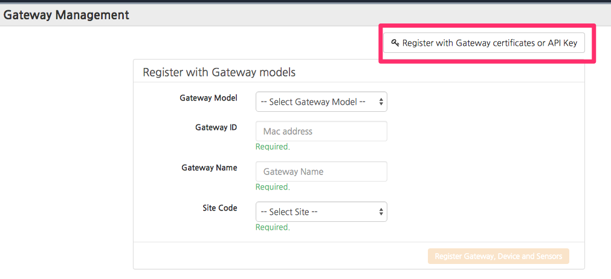

Thing+ Embedded Integration Guide
---------------------------------

## Step 1: Choose Thing+ Gateway or Thing+ Device

Thing+ Embedded covers two kinds of device category. Choose Thing+ Gateway or Thing+ Device.

### Thing+ Gateway 
  * Embedded Linux based devices: 
    - Ex) Libelium's Meshlium, Raspberry Pi and etc.
  * Advanced OS(Linux, Windows or OSX) based systems:
    - Ex) Windows based Kiosk and POS terminal

### Thing+ Device
  * RTOS based devices
  * Ex) TI CC3200 based WiFi module, mbed, Arduino + Network Shield

## Step 2: Gateway registeration
### Pre-register your Gateway
* Register the gateway
  - Go to Thing+ Portal
    - https://yourservice.thingplus.net
    - If you have no registered service, contact Thing+ support team for new service creation.
  - Go to `Gateway Management` page (via upper right menu)
  - Click the + button in the upper right corner
  - Click `Register with Gateway certificates or API Key` button

  

  - Fill form
    - Gateway ID, Gateway Name, Site Code(default or other site)
    - Select `API Key` (Authentication Type)
  - Register and get API Key
  - Copy the `API Key`

  

## Step 3: Put "API Key" to your system. 
  - Thing+ Device,
    - In your special way, put `API Key` as a mqtt connection password.
  - Thing+ Gateway,
    - Go to `SETTING` --> `Register Gateway API Key`
    - Fill the `API Key` copied at the previous step.
    - Click `Upload API Key` button (applied after restarting Thing+ Gateway)

  


## Step 4: Register Sensors
  - Go to Thing+ Portal
  - Go to `Gateway Management` page (via upper right menu)
  - Click the + button in the upper right corner
  - Fill form
    - Select Gateway Model
    - Input Gateway ID (the same MAC address when registering gateway)
    - Select Device Model
    - Input Device Addess
    - Input Device Name
    - Select Sensors to register (all sensors are selected as default)
  - Click `Register Gateway, Device and Sensors` button
    - Thing+ Gateway app will restart and send the sensor data in a few minutes.  You can see the sensor data at Dashboard or Sensor page

  


## Step 5: Define new gateway/device model unless listed in the previous step.

If your gateway/device model is not listed at `Gateway Management` in the previous step, contact Thing+ support team to add new gateway/device model.
  

The gateway model defines device models. Each device model defines list of sensor actuators. Depending on device capability, the list of sensors and actuators can be discoverable dynamically or pre-defined beforehand.

For more about all sensor and actuator lists, please see [sensorTypes](docs/gateway/sensorTypes.md). 

## Step 6: Do porting

### Thing+ Gateway 
  - How to install, configuration, logging etc at [gateway.md](/docs/gateway.md)
  - To interface with your sensors, follow instructions at [sensorjs-jsonrpc](https://github.com/daliworks/sensorjs-jsonrpc)

### Thing+ Device
  - For limited device, you need to implement [Thing+ Device API over MQTT](/docs/gateway/mqttProtocol.md) set.  [Thing+ Device workspace](https://github.com/daliworks/thingplus-device) has the code sample which implements `Thing+ Device API over MQTT`. 
  - [Thing+ Device API over http REST](/docs/gateway/restProtocol.md) is available as well. Please note that there are limitations comparing to MQTT API. REST API cannot support actuatation, remote device configuration and etc.

Please contact Thing+ support team for access permission to above workspaces.

```
Copyright (c) 2014, Daliworks. All rights reserved.
Reproduction and/or distribution in source and binary forms
without the written consent of Daliworks, Inc. is prohibited.
```

