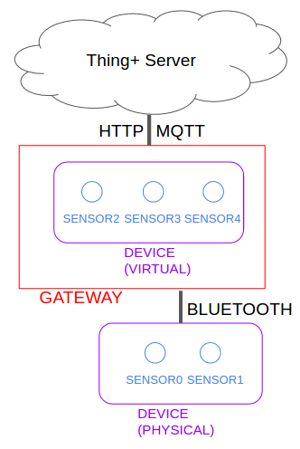
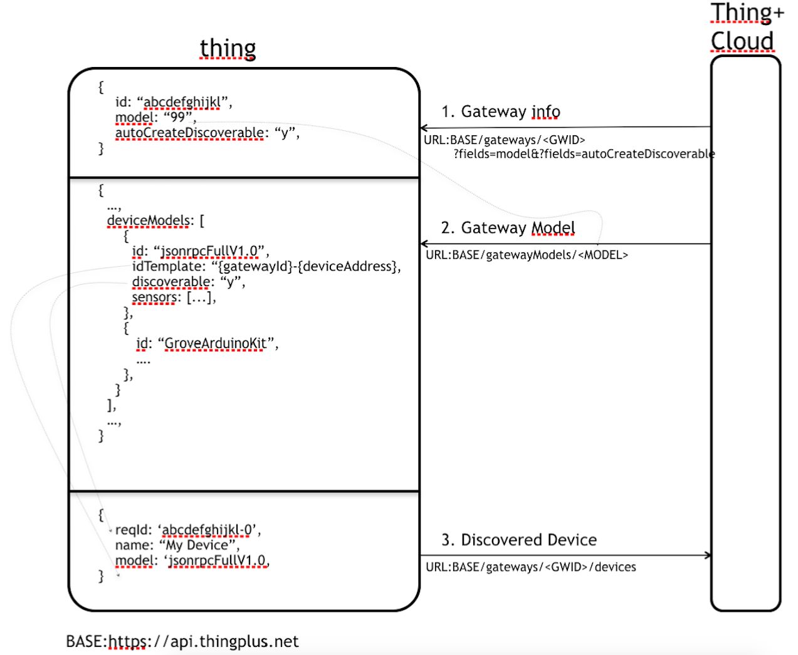
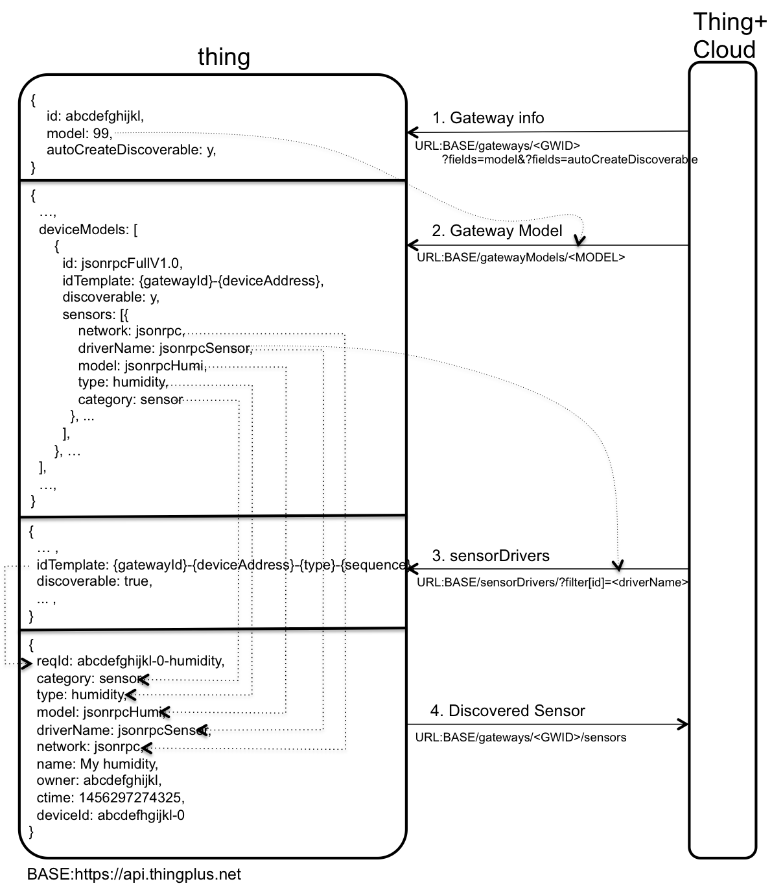
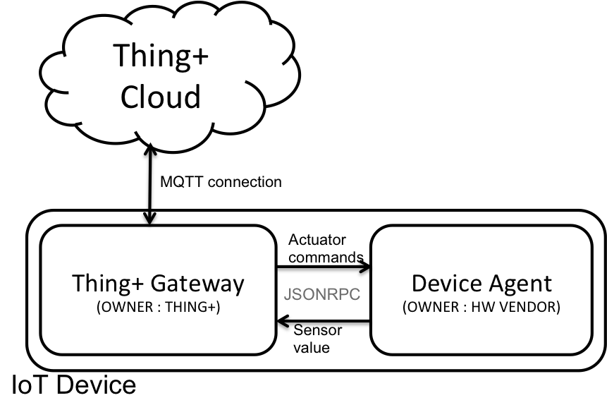
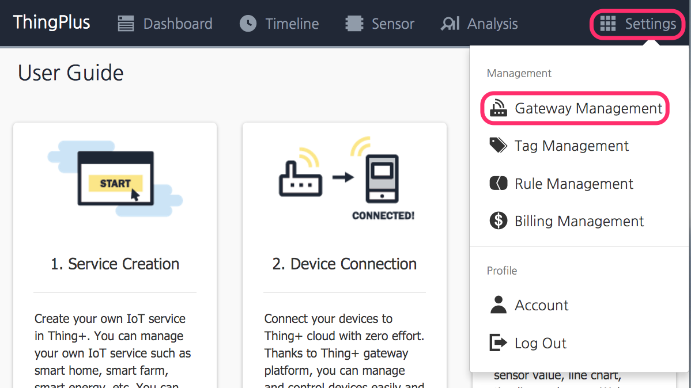
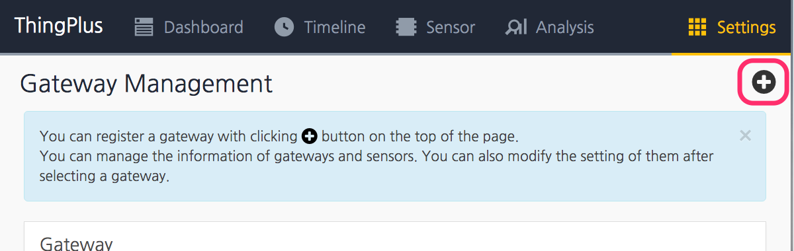
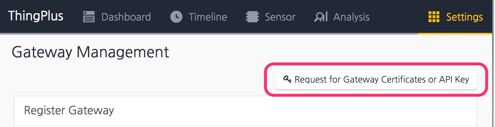
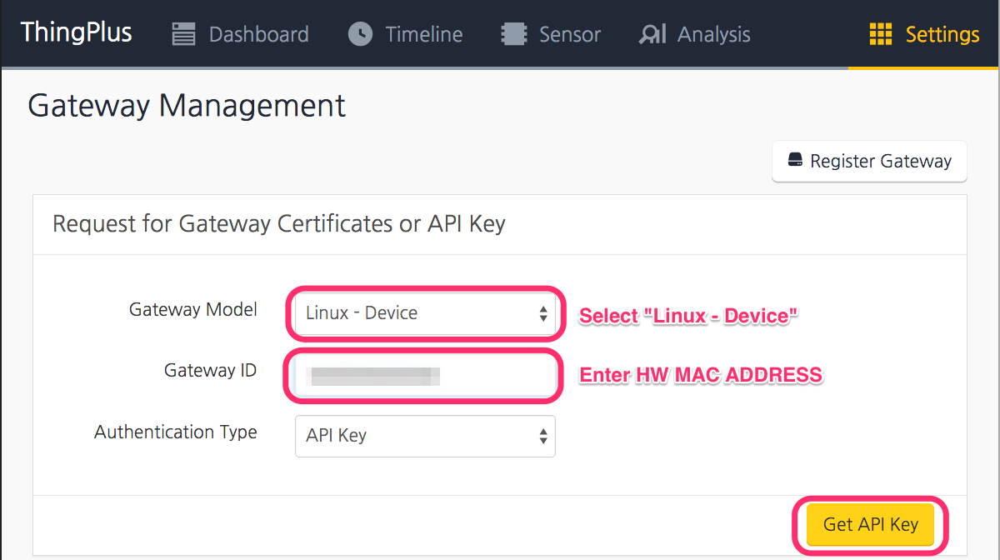
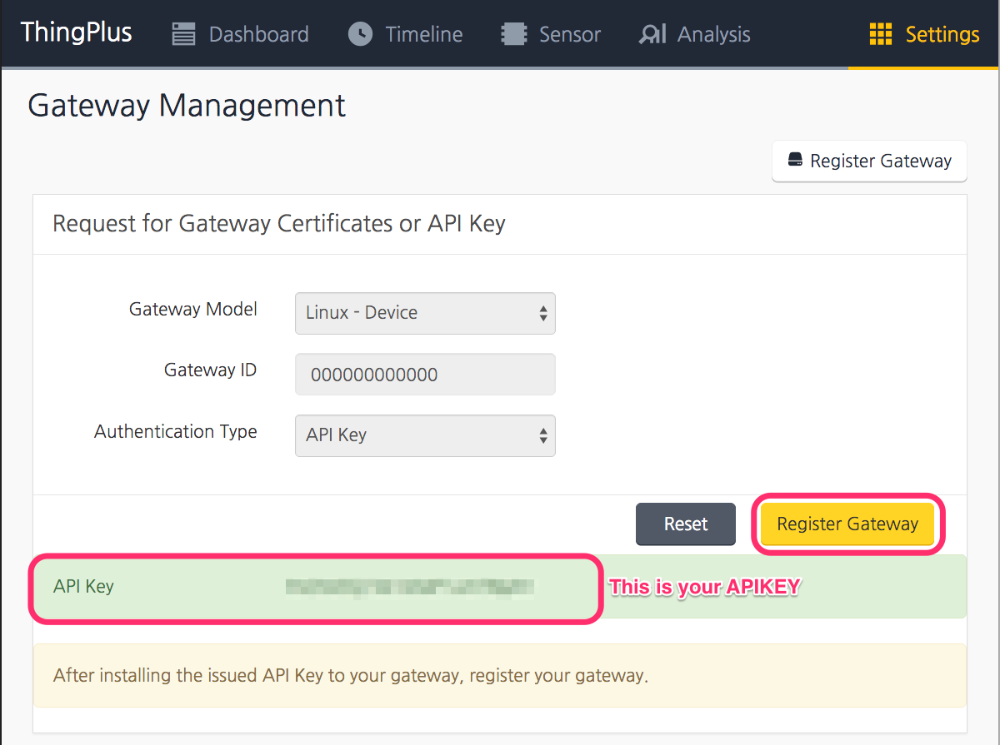
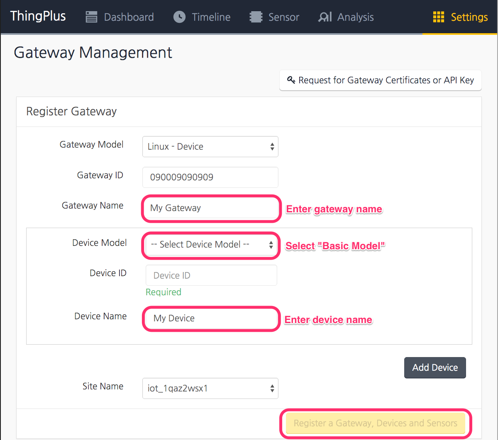

# Thing+ Embedded Guide

Thing+ Embedded는 다양한 IoT 기기들이 Thing+ Cloud에 연결될 수 있도록 프로토콜을 정의하고 있으며, IoT 기기(thing) 제조사들이 Thing+ 연동을 쉽게 할 수 있도록 라이브러리를 제공하고 있습니다. 또한, IoT 기기와 Thing+ Cloud 연결과 하드웨어에 맞는 부가적인 기능이 포함된 Thing+ Gateway 프로그램도 포함이 됩니다.<br>

## 0. Thing+ Overview
[홈페이지](https://thingplus.net/) 참조

## 1. Thing+ Embedded Overview
Thing+ Embedded는 Thing+ MQTT 프로토콜, Thing+ Embedded SDK, Thing+ Gateway로 구성됩니다.<br>
Thing+ MQTT 프로토콜은 Thing+ Cloud와 하드웨어 사이에 사용하는 MQTT 토픽과 메시지를 정의하고있습니다. Thing+ Embedded SDK는 Thing+ MQTT를 구현한 라이브러이입니다(개발중). Thing+ Gateway는 Daliworks에서 개발한 Thing+ MQTT 프로토콜을 따르는 소프트웨어입니다.<br>

Thing+와 하드웨어를 연동하는 방법은 3가지가 있습니다.

1. Thing+ MQTT 프로토콜을 참고하여 소프트웨어 작성
   - 하드웨어 업체는 Thing+ MQTT 프로토콜 문서와 C로 작성된 예제 코드를 참고하여 IoT 기기에 구동되는 Thing+ 연동 소프트웨어를 개발하실 수 있습니다. 개발해야 할 항목은 Thing+ Cloud 연결 및 데이터 송수신, MQTT 메시지 생성 및 분석, 시간동기 등이 있습니다. 개발 자유도가 가장 높으며, 하드웨어에 최적화 된 소프트웨어를 작성하실 수 있습니다.
2. Thing+ Embedded SDK 라이브러리 이용하며 소프트웨어 작성
   - 하드웨어 업체에서 Thing+ 연동 소프트웨어를 보다 쉽게 개발할 수 있도록 Thing+ Embedded SDK를 제공하고 있습니다. 센서 등록 및 데이터 전송 등을 담당하며, Linux 기반의 H/W에서 사용 가능합니다.
3. Thing+ Gateway를 사용하고, Device Agent 작성
   - Thing+ Gateway는 Thing+ Cloud와의 연결을 담당하고, Device Agent는 센서값을 읽고 액추에이터를 동작시키는 일을 합니다. 하드웨어 업체든 Device Agent 부분을 작성하시면 됩니다. **단, Thing+ Gatweay를 사용하기 위해선 하드웨어에 Node.js가 설치되어야 하며, RTOS, Micro OS, Firmware를 이용하는 하드웨어는 사용할 수 없습니다.** Thing+ Gateway와 Device Agent 사이의 프로토콜 문서와 예제코드를 참고하실 수 있습니다.


### 1.0 Guidelines for things

Thing+와 연동하는 IoT 기기(thing)는 다음사항을 충족시켜야 합니다.

1. 하드웨어는 SSL, TLS, MQTT 이용해 Thing+ Cloud에 접속이 가능해야 합니다.
   - 하드웨어의 로컬시간은 Thing+에서 서버시간과 동기화되어야 합니다.
   - 하드웨어와 Thing+ Cloud간 접속이 끊어졌을 경우 하드웨어는 3시간동안 센서값을 저장하여 데이터 유실을 최소화 해야 합니다.
   - 네트워크가 재연결되면 저장한 센서값을 Thing+ Cloud에 전송해야 합니다.
   - 하드웨어는 주기적으로 기기의 상태와 센서의 상태를 Thing+ Cloud에 전송해야 합니다.
   - 하드웨어에 시리즈 센서가 있을 경우, 전송 주기를 지켜야합니다. 최소 전송 주기는 1분입니다.
   - 전송주기가 변경될 경우, 하드웨어는 새로운 전송 주기에 맞쳐 센서값을 올려야 합니다.
   - 하드웨어는 MQTT 구독을 Thing+에서 정한 토픽만 해야합니다.

### 1.1 Thing+ Embedded에서 정의한 개념 설명

#### 1.1.1 Gateway, Device, Sensor


게이트웨이(Gateway): Thing+가 정의한 게이트웨이는 MQTT 또는, HTTP 연결이 가능한 하드웨어로 Thing+ 서버에 접속하여, 센서 데이터를 전송하고, 액추에이터 명령어를 받는 역할을 하는 장비입니다.

디바이스(Device): Thing+가 정의한 디바이스는 게이트웨이 안에 연결된 센서의 집합을 의미합니다. 예를 들어, 게이트웨이 내부에, 블루투스로 연결되는 온도, 습도 센서가 있다면, 블루투스 기기가 하나의 디바이스로 정의할 수 있습니다. 디바이스는 물리적인 하드웨어 일 수도 있고, 가상의 센서 집합이 될 수 도 있습니다.

센서(Sensor): Thing+ 정의한 센서는 온도, 습도 등을 측정하는 하드웨어로 일반적으로 사용하는 센서의 의미와 동일합니다. 또한, 액추에이터도 센서의 한 종류에 포함이 됩니다. 모든 센서는 하나의 게이트웨이에만 속해 있으며,

#### 1.1.2 Gateway ID, APIKEY, Sensor ID
게이트웨이 아이디(Gateway ID): Thing+에 연결된 각 게이트웨이가 가지는 고유의 ID를 의미합니다. 12자리 문자열로 구성이 되며, 일반적으로 유선랜의 MAC어드레스를 사용합니다. </br>

APIKEY: Thing+에서 발급하는 KEY로 MQTT 인증에 사용됩니다. Thing+ 포털에 게이트웨이 아이디를 등록하면 APIKEY를 발급하실 수 있으며, **발급된 APIKEY는 해당 게이트웨이에만 유효합니다. 게이트웨이는 발급받은 APIKEY를 저장하고 있어야하며, MQTT 접속 시 인증 비밀번호로 APIKEY를 사용해야 합니다.**

센서 아이디(Sensor ID): 각 센서가 가지는 고유의 ID를 의미합니다. 일반적으로 센서 아이디는 게이트웨이 아이디와 센서 타입의 조합으로 만들 수 있습니다. 센서 아이디는 게이트웨이 관리 페이지에서 확인할 수 있습니다.

#### 1.1.3 Event Sensor, Series Sensor, Report Interval
Thing+는 센서의 종류에 따라 이벤트(Event) 센서와 시리즈(Series) 센서로 구분하고 있습니다. 이벤트 센서는 센서값이 변할 때 센서값을 즉시 Thing+에 전송하는 센서입니다. 시리즈 센서는 하드웨어에서 센서값을 주기적으로 전송하는 센서입니다. <br>
리포트 인터벌(Report Interval)은 시리즈 센서의 전송 주기를 의미하며, 최소 리포트 인터벌은 60초입니다.

#### 1.1.4 Sensor, Actuator lists
Thing+는 지원하는 센서와 액추에이터를 정의하고 있습니다. 센서, 액추에이터 타입은 Thing+에서 정한 고유의 문자열이며 IoT 기기 제조사들은 Thing+에서 정한 타입을 사용해야 합니다. 만약 잘못된 타입을 사용하면, Thing+ Portal에 아이콘, 그래프 등이 잘못 표시될 수 있습니다.

대표적인 센서의 목록은 아래와 같습니다.<br>
##### 1.1.4.1 시리즈 센서
- 숫자를 값으로 가지는 센서

|센서|Type|단위|센서|Type|단위
|:---|:---|:---|:---|:---|:---
|숫자센서|number|없음|문자센서|string|없음
|온도|temperature|°C|습도|humidity|%
|조도|light|lux|소음|noise|dB
|이산화탄소|co2|ppm|일산화탄소|co|ppm
|VOC|voc|ppm|전력량|power|kWh
|먼지|dust|µg/m³|개수|count|ea
|전압|voltage|V|전류|current|A
|무게|weight|g|진동|vibration|V
|속도|speed|m/s|압력|pressure|bar
|각도|rotaryAngle|°|퍼센트|percent|%
|걸음수|stepCount|walks|베터리량|batteryGauge|%
|풍속|windSpeed|m/s|강수량|rain|mm/min
|토양온도|soilTemperature|°C|토양습도|soilMoisture|%
|자외선(B)|ultraviolet-b|W/m²|기간|timeDuration|sec
|일조량|solarRadiation|µmol/m²/s"|전력|wattage|kW


- 특정한 값을 가지는 센서

|센서|Type|단위|값|비고
|:---|:---|:---|:---|:---
|색|color|없음|{r:[0~255],g:[0~255],b:[0~255]}
|가속도|m/s²|accelerometer|{x:값,y:값,z:값}
|수면상태|없음|sleepStage|0<br>1<br>2<br>3|AWAKE<br>REM <br> LIGHT <br>DEEP
|테그|tag|없음|"in", "out" or "tagged"
|풍향|windVane|없음|0<br>22.5<br>45<br>67.5<br>90<br>112.5<br>135<br>157.5<br>180<br>202.5<br>225<br>247.5<br>270<br>292.5<br>315<br>337.5<br>|N<br>NNE<br>NE<br>ENE<br>E<br>ESE<br>SE<br>SSE<br>S<br>SSW<br>SW<br>WSW<br>W<br>WNW<br>NW<br>NNW<br>

##### 1.1.4.2 이벤트 센서
|센서|Type|값|단위|센서|Type|값|단위
|:---|:---|:---|:---|:---|:---|:---|:---
|토글센서|onoff|0 또는 1|lvl|움직임감지|motion|0, 1|없음
|문열림|door|0 또는 1|없음|개수|countEvent|숫자|ea

##### 1.1.4.3 액추에이터

|액추에이터|Type|명령어|명령어 설명|파라미터|파라미터 설명
|:---|:---|:---|:---|:---|:---
|LED|led|on|켜기|duration|지속시간(단위 ms)
| | |blink|깜빡임|duration<br>interval|지속시간(단위 ms)<br>깜빡이는 주기(단위 ms)
| | |off|끄기|없음|
|파워스위치|powerSwitch|on|켜기|duration|지속시간(단위 ms)
| | |off|끄기|없음|
|부저|buzzer|on|켜기|없음|
| | |off|끄기|없음|
|LCD|lcd|print|출력|text<br>row<br>column|출력할 문자열<br>x좌표<br>y좌표
| | |clear|문자열 삭제|row|삭제할 줄<br> -1이면 전체 삭제
|카메라|camera|snapPicture|사진찍기|없음|
|문자열 액추에이터|stringActuator|send|액추에이터 실행|text|사용자 정의 문자열

Thing+가 지원하는 센서, 액추에이터의 전체 목록은 [센서,엑츄에이터 정의파일](https://api.thingplus.net/v1/sensorTypes "Title")(Thing+ 포털 로그인 후 확인 가능)에서 확인할 수 있습니다.

만약 사용하시는 센서, 액추에이터가 목록에 빠져있으면 Appendix A의 게이트웨이, 센서 등록 양식을 작성하여 contact@thingplus.net으로 보내주시기 바랍니다.


## 2. Thing+ Embedded Protocol

Thing+는 IoT 기기와 주고 받는 데이터 형식을 사전에 정의해 두었으며, 이를 Thing+ Embedded 프로토콜이라고 합니다. thing은 Thing+에서 정의한 형태로 데이터를 구성하여 Thing+로 전송해야 하며, Thing+도 Embedded 프로토콜에서 정의한 형식에 따라 데이터를 전송합니다.


Thing+와 IoT 기기들 사이 사용하는 네트워크 프로토콜은 MQTT와 HTTP입니다. MQTT는 IoT 기기에서 수집한 센서값, 액츄에이터 명령어 등이 전송이 되며, HTTP로는 thing에서 사용하는 디바이스, 센서를 추가할 때 사용됩니다. Thing+ Portal에서 디바이스와 센서를 추가하는 게이트웨이는 HTTP 프로토콜은 사용 안하셔도 됩니다.


### 2.1 MQTT
MQTT(Message Queuing Telemetry Transport)는 경량 메시지 프로토콜로 낮은 대역폭과 낮은 전력을 사용하는 IoT 기기와 Thing+ Cloud 사이에 사용되는 프로토콜입니다. MQTT는 Publish/Subscribe 구조로 되어으며, TCP/IP를 통해 구현됩니다. SSL 및 TLS를 사용하여 데이터 보안을 할 수 있고, USERNAME/PASSWORD 기반의 인증방법을 제공하고 있습니다.


MQTT 브로커(Broker)는 다양한 클라이언트들이 메시지를 주고 받을 수 있도록 메시지를 전달하는 역할을 합니다. Thing+ Cloud는 MQTT 브로커를 제공하고 있으며, IoT 기기는 Thing+ Cloud가 제공하는 MQTT 브로커에게 센서값을 전송(Publish)하고, 액추에이터 명령을 수신(Subscribe)하여 명령에 맞는 동작하면 됩니다.

메시지를 생성하는 클라이언트(Publisher)는 메시지 앞에 토픽(Topic)을 붙여 발행하고, 메시지를 구독하는 클라이언트(Subscriber)는 수신할 토픽을 브로커에 등록합니다. MQTT 브로커는 토픽을 기준으로 메시지를 중계합니다. 토픽은 계층이 있으며, 토픽 구분을 위해 슬래시(/)를 사용합니다.<br>

```
토픽 예)
HOME0/BEDROOM/TEMERTATURE
HOME0/BEDROOM/HUMIDITY
HOME0/LIVING/CO2_LEVEL
HOME1/KITCHEN/DUST_LEVEL
```

MQTT는 3단계의 QoS(Quality of Service)를 제공합니다.

- QoS0: 메시지는 한 번만 전송되며, 전송의 성공, 실패를 확인하지 않습니다. 메시지 유실 가능성이 있습니다.
- **QoS1**: 메시지는 한 번 이상 전송될 수 있습니다. 메시지는 항상 정확하게 전달되며, 전달과정 중 중복으로 전달될 수 있습니다. **Thing+ Cloud는 QoS1을 사용하고 있습니다.**
- QoS2: 메시지는 정확히 한번만 전송이 되며, 메시지 유실 및 중복 전송을 유발하지 않습니다. 하지만 메시지 전송에 많은 네트워크 대역폭이 요구됩니다.

MQTT는 클라이언트 접속이 끊어졌을 경우, 다른 클라이언트에게 전송할 메시지를 저장할 수 있는 Last Will and Testament(LWT) 기능을 제공합니다. 클라이언트는 Will 메시지를 정의할 수 있으며, 브로커는 이 메시지를 저장하고 있습니다. 클라이언트가 에러에 의해 접속이 끊어졌을 경우 브로커는 Will 메시지를 다른 클라이언트에게 전송합니다. Thing+는 thing의 에러 상태를 Will 메시지로 사용하고 있으며, thing에 에러가 발생 시 Thing+ Cloud는 즉각 기기의 에러를 알 수 있습니다.

### 2.2 Thing+ MQTT Protocol
Thing+에서 사용하는 MQTT 토픽과 데이터 포맷에 대해서 설명합니다. **Thing+와 연동을 원하는 하드웨어 업체는 이 장에서 정의한 토픽과 데이터 포맷에 맞게 센서값을 전송해야하며, Thing+도 이 프로토콜에 기반하여 액추에이터 명령어를 전송합니다.**

- MQTT 메시지는 **QoS1**을 사용하며, WiLL 메시지를 제외한 모든 메시지의 RETAIN은 사용하지 않습니다.</br>
- 시간 값은 [UTC](https://en.wikipedia.org/wiki/Unix_time)를 사용합니다.</br>
- 하드웨어는 MQTT 연결 상태, 게이트웨이 상태, 센서 상태 메시지를 전송하며 상태를 정의하는 값은 아래와 같습니다.

>
상태|값(문자열)
:---|:---
켜짐|on
꺼짐|off
에러발생|err

#### 2.2.1 MQTT 연결 설정
Thing+가 사용하는 MQTT 버전은 3이며, 포트는 8883입니다. **thing이 설치되는 네트워크에 8883 포트가 막혀있으면 Thing+에 접속할 수 없습니다.**</br>

Thing+ 브로커에 MQTT 연결시 반드시 SSL을 사용하는 **mqtts** 프로토콜을 사용해야 합니다. 암호화되지 않은 MQTT 연결은 허용되지 않습니다.</br>

MQTT 접속 아이디는 게이트웨이 아이디, 비밀번호는 APIKEY입니다. WiLL 메시지의 토픽은 *v/a/g/{gateway_id}/mqtt/status*이고, 메시지 내용은 'err'이고, Retain은 True 입니다. 재접속 시 세션은 새로 생성하도록 설정해야합니다.</br>

MQTT Connection SPEC|Thing+ Definition
---|:---
MQTT Version | 3
PORT | 8883
MQTT Client ID | {gateway_id}
Clean Session | TRUE
MQTT ID | {gateway_id}
MQTT Passworkd | {APIKEY}
Will Topic | v/a/g/{gateway_id}/mqtt/status
Will Message | err
Will Message Retain | TRUE
Keep Alive[sec] | {report_interval} x 2    (**Recommend**)

#### 2.2.2 MQTT 상태 전송
하드웨어는 MQTT 접속에 성공한 경우 MQTT의 상태가 정상임을 전송해야합니다.</br>

##### MQTT 접속 상태 전송

```javascript
TOPIC: v/a/g/__GATEWAY_ID__/mqtt/status
MESSAGE: on

__GATEWAY_ID__: 게이트웨이 아이디
```
##### Example

```
TOPIC: v/a/g/000011112222/mqtt/status
MESSAGE: on
```
#### 2.2.3 게이트웨이 상태 전송
게이트웨이는 주기적으로 게이트웨이 상태와 상태의 유효시간을 전송해야합니다. 만약, Thing+가 유효시간이 내에 게이트웨이 상태를 재수신하지 못하면 해당 thing에 에러가 발생하였다고 판단합니다.<br>

##### 게이트웨이 상태 전송

```javascript
TOPIC: v/a/g/__GATEWAY_ID__/status
MESSAGE: __HW_STATUS__,__VALID_DURATION__

__HW_STATUS__: 게이트웨이의 상태. on|off
__VALID_DURATION__: 상태의 유효시간. sec
```

##### Example

```
TOPIC: v/a/g/000011112222/status
MESSAGE: on,90
```


#### 2.2.4 센서 상태 전송
게이트웨이는 주기적으로 센서 상태와 상태의 유효시간을 전송해야합니다. 만약, Thing+가 유효시간이 내에 센서 상태를 재수신하지 못하면 해당 센서에 에러가 발생하였다고 판단합니다.<br>

##### 센서 상태 전송

```javascript
TOPIC: v/a/g/__GATEWAY_ID__/s/__SENSOR_ID__/status
MESSAGE: __SENSOR_STATUS__,__VALID_DURATION__

__GATEWAY_ID__: 게이트웨이 아이디
__SENSOR_ID__: 센서 아이디
__SENSOR_STATUS__: 센서의 상태. on|off
__VALID_DURATION__: 상태의 유효시간. sec
```

##### Example

```
TOPIC: v/a/g/000011112222/s/000011112222-temperature-0/status
MESSAGE: on,90
```

#### 2.2.5 게이트웨이 상태와 N개의 센서 상태 전송
게이트웨이 상태 전송 메시지에 센서의 상태를 붙여서 전송 할 수도 있습니다. 하나의 토픽을 이용하여 게이트웨이 상태와 센서의 상태를 같이 전송하기 때문에, 네트워크 비용이 비싼 하드웨어는 이 방법을 이용하면 네트워크 비용을 줄일 수 있습니다. 만약 이 방법을 사용하였다면, 개별 센서의 상태는 별도로 전송하지 않아도 됩니다.

##### 게이트웨이 상태와 N개의 센서 상태 전송

```javascript
TOPIC: v/a/g/__GATEWAY_ID__/status
MESSAGE: __HW_STATUS__,__VALID_DURATION__,__SENSOR_ID__,__SENSOR_STATUS__,__VALID_DURATION__, ...(REPEAT FOR SENSOR), __SENSOR_ID__,__SENSOR_STATUS__,__VALID_DURATION__
}

__GATEWAY_ID__: 게이트웨이 아이디
__HW_STATUS__: 게이트웨이의 상태. on|off
__VALID_DURATION__: 상태의 유효시간. sec
__SENSOR_ID__: 센서 아이디
__SENSOR_STATUS__: 센서의 상태. on|off
```

##### Example

```
TOPIC: v/a/g/000011112222/status
MESSAGE: on,90,000011112222-onoff-0,on,90,000011112222-temperature-0,off,90
```


#### 2.2.6 센서값 전송
하드웨어는 개별 센서의 값을 전송할 수 있습니다. 하드웨어는 센서값과 시간을 쌍으로 전송해야하며, 한개의 센서에 대해 여러개의 센서값을 한꺼번에 전송할 수도 있습니다. 여러개의 센서값 전송 시 시간순으로 정렬이 되어있어야 합니다. 센서값과 시간을 배열로 묶은 형태도 전송이 가능합니다. </br>

##### 센서 값 전송

```javascript
TOPIC: v/a/g/__GATEWAY_ID__/s/__SENSOR_ID__
MESSAGE: __TIME__,__VALUE__, ...(REPEAT FOR VALUES), __TIME__,__VALUE__

__GATEWAY_ID__: 게이트웨이 아이디
__SENSOR_ID__: 센서 아이디
__TIME__: 센싱 시간. UTC기준이며 단위는 msec
__VALUE__: 센서값
```

##### Example

```
TOPIC: v/a/g/000011112222/s/000011112222-temperature-0
MESSAGE: 146156161000,26.5,146156162000,27.5,146156163000,30
```

##### 센서 값 전송 (시간, 값을 배열로 묶음)

```javascript
TOPIC: v/a/g/__GATEWAY_ID__/s/__SENSOR_ID__
MESSAGE: [__TIME__,__VALUE__, ...(REPEAT FOR VALUES)__TIME__,__VALUE__]

__GATEWAY_ID__: 게이트웨이 아이디
__SENSOR_ID__: 센서 아이디
__TIME__: 센싱 시간. UTC기준이며 단위는 msec
__VALUE__: 센서값
```

##### Example

```
TOPIC: v/a/g/000011112222/s/000011112222-temperature-0
MESSAGE: [146156161000,26.5,146156162000,27.5,146156163000,30]
```


#### 2.2.7 N개 센서의 센서값 전송
하드웨어에 연결된 여러개의 센서 값을 한꺼번에 전송합니다. 각각의 센서에 대해서 여러개의 센서값을 한꺼번에 전송할 수도 있습니다. 센서값은 시간순으로 정렬이 되어있어야 합니다.

##### N개 센서의 센서값 전송

```javascript
TOPIC: v/a/g/__GATEWAY_ID__
MESSAGE: {"__SENSOR_ID__":[__TIME__,__VALUE__,...(REPEAT FOR VALUES),__TIME__,__VALUE__],"__SENSOR_ID__":[__TIME__,__VALUE__,...,__TIME__,__VALUE__], ...(REPEAT FOR SENSORS), "__SENSOR_ID__":[__TIME__,__VALUE__,...(REPEAT FOR VALUES),__TIME__,__VALUE__]}

__GATEWAY_ID__: 게이트웨이 아이디
__SENSOR_ID__: 센서 아이디
__TIME__: 센싱 시간. UTC기준이며 단위는 msec
__VALUE__: 센서값

메시지에 {, }, [, ], "" 가 포함됩니다.
```

##### Example

```
TOPIC: v/a/g/000011112222
MESSAGE: {"000011112222-temperature-0":[1461563978000,27.5,1461563978000,28.5],"000011112222-humidity-0":[146156161000,30,146156162000,35,146156163000,40]}
```

#### 2.2.8 Thing+가 하드웨어에게 작업을 요청하는 메시지

Thing+는 액추에이터 실행, 하드웨어 환경 설정 등의 작업을 요청(Request)할 수 있으며, 하드웨어는 주어진 포맷에 따라 응답(Reponse)을 해야합니다.

하드웨어는 서버의 작업 요청을 받기 위해 토픽을 구독해야 하여, Thing+가 요청하는 메시지 포맷은 아래와 같습니다.

##### Thing+가 하드웨어에게 작업 요청

```
TOPIC: v/a/g/__GATEWAY_ID__/req
MESSAGE: {"id": __MESSAGE_ID__, "method": __METHOD__, "params": __PARAMS__}

__GATEWAY_ID__: 게이트웨이 아이디
__MESSAGE_ID__: 메시지 아이디. 메시지의 고유값으로 서버가 전송합니다.
__METHOD__: 수행해야 할 작업 이름
__PARAMS__: 파라미터

메시지에 {, }, "가 포함됩니다.
```

##### Example

```
TOPIC: v/a/g/000011112222/req
```

#### 2.2.9 Thing+가 요청한 작업 결과 전송
하드웨어는 Thing+가 요청한 작업을 수행한 후 결과를 Thing+에게 알려줘야 합니다.
하드웨어가 응답하는 메시지 포맷은 작업의 성공, 실패에 따라 달라집니다.

##### Thing+ 요청 작업의 결과

```javascritp
TOPIC: v/a/g/__GATEWAY_ID__/res
MESSAGE IF SUCCESS": {"id":__MESSAGE_ID__,"result":__RESULT__}
MESSAGE IF FAILED ": {"id":__MESSAGE_ID__,"error":"code":__ERR_CODE__, "message":__ERR_MSG__}}
__GATEWAY_ID__: 게이트웨이 아이디
__MESSAGE_ID__: 메시지 아이디. 메시지의 고유값으로 서버가 전송합니다.
__RESULT__: 작업의 결과
__ERR_CODE__: 실패일 경우의 에러코드
__ERR_MSG__: 실패 이유

메시지에 {, }, "가 포함됩니다.
```

에러코드는 [JSONRPC의 에러코드 규칙](http://xmlrpc-epi.sourceforge.net/specs/rfc.fault_codes.php)을 따르며, 자세한 에러원인은 {error_message} 에 적어주면 됩니다.

#### 2.2.10 Thing+가 요청하는 작업 목록

##### Method List

Method|Description|Parameters|Param Description
:---|:---|:---|:---
timeSync|시간 동기|{"time":\_\_TIME\_\_}|\_\_TIME\_\_: 서버시간(UTC)
controlActuator|액추에이터 실행|{"id":\_\_SENSOR_ID\_\_,"cmd":\_\_CMD\_\_,"options",\_\_OPTIONS\_\_}|\_\_SENSOR_ID\_\_: 액추에이터 아이디<br>\_\_CMD\_\_: 명령어<br>\_\_OPTIONS\_\_: 명령어 옵션<br>
setProperty|리포트 인터벌 변경|{"reportInterval}":\_\_INTERVAL\_\_|\_\_INTERVAL\_\_: 리포트 인터벌
poweroff|하드웨어 종료|None|None
reboot|하드웨어 재시작|None|None
restart|소프트웨어 재시작|None|None
swUpdate|소프트웨어 버전 업그레이드|None|None
swInfo|소프트웨어 버전 정보|None|None

위 메쏘드 중 timeSync, setProperty는 의무적으로 구현해야 하며, 나머지는 필요한 것들만 구현하시면 됩니다.

##### timeSync
timeSync 메쏘드는 Thing+에서 하드웨어 시간을 설정할 때 사용합니다. thing의 로컬시간이 틀릴 경우, 센서값을 읽은 시간에 오류가 발생합니다. 따라서, Thing+는 하드웨어 시간을 서버시간에 맞출 수 있도록 서버시간을 전송합니다.

###### timeSync params

```javascript
TOPIC: v/a/g/__GATEWAY_ID__/req

REQUEST MESSAGE: {"id":"__MESSAGE_ID__", "method":"timeSync","params":{"time":__SERVER_TIME__}}

RESPONSE IF SUCCESS: {"id":"__MESSAGE_ID__","result":""}
RESPONSE IF FAILED: {"id":"__MESSAGE_ID__","error":{"code":__ERR_CODE__, "message":"__ERR_MSG__"}}

__GATEWAY_ID__: 게이트웨이 아이디
__MESSAGE_ID__: 메시지 아이디
__SERVER_TIME__: 서버시간. UTC
__ERR_CODE__: 에러코드
__ERR_MSG__: 에러 메시지
```

###### Example

```
TOPIC: v/a/g/1928dbc93871/req

REQUEST MESSAGE: {"id":"e1kcs13b9","method":"timeSync","params":{"time":1372874401865}}

RESPONSE IF SUCCESS: {"id":"e1kcs13b9","result":""}
REPONSE IF FAILED: {"id":"e1kcs13b9","error":{"code": -32000, "message": "invalid options"}}
```

##### setProperty
setProperty 메쏘드는 리포트 인터벌을 전달할 때 사용합니다. 리포트 인터벌의 단위는 msec입니다. Thing+ 포털에서 리포트 인터벌을 변경할 수 있습니다.

###### setProperty params

```javascript
TOPIC: v/a/g/__GATEWAY_ID__/req

REQUEST MESSAGE: {"id":"__MESSAGE_ID__","method":"setProperty","params":{"reportInterval":__INTERVAL__}}

RESPONSE IF SUCCESS: {"id": "__MESSAGE_ID__", "result"}
RESPONSE IF FAILED: {"id":"__MESSAGE_ID__","error":{"code":__ERR_CODE__, "message":"__ERR_MSG__"}}
```

###### Example

```
TOPIC: v/a/g/1928dbc93781/req
REQUEST MESSAGE: {"id":"e1kcs13bb","method":"setProperty","params":{"reportInterval":"60000"}}

RESPONSE IF SUCCESS: {"id":"e1kcs13bb","result":""}
RESPONSE IF ERROR: {"id":"e1kcs13bb","error":{"code":-32000,"message":"invalid interval"}}
}
```

##### controlActuator
controlActuator 메쏘드는 액추에이터에 명령을 내릴 때 사용합니다. 액추에이터의 명령어 및 옵션는 Thing+에서 정의하고 있으며, 메시지의 파라미터로 전송이 됩니다.<br>
액추에이터 명령어 및 옵션의 목록은 [센서,엑츄에이터 정의파일](https://api.thingplus.net/v1/sensorTypes "Title")(Thing+ 포털 로그인 후 확인 가능)에서 확인하실 수 있습니다.

######  대표적인 액추에이터 명령어 및 명령어 옵션

Actuator|Command|Option
:---|:---|:---
led|on|duration
led|off|
led|blink|duration <br> interval
powerSwitch|on|duration
powerSwitch|off|None

###### controlActuator params

```javascript
TOPIC: v/a/g/__GATEWAY_ID__/req
REQUEST MESSAGE: {"id":"__MESSAGE_ID__", "method":"controlActuator", "params":{"id":__SENSOR_ID__,"cmd":__CMD__, "options":{__OPTIONS__}}

RESPONSE IF SUCCESS: {"id": "__MESSAGE_ID__", "result":""}
RESPONSE IF FAILED: {"id":"__MESSAGE_ID__","error":{"code":__ERR_CODE__, "message":"__ERR_MSG__"}}
```

###### Example: LED ON

```
TOPIC: v/a/g/1928dbc93781/req
REQUEST MESSAGE: {"id":"46h6f8xp3","method":"controlActuator","params":{"id":"led-1928dbc93781-r","cmd":"on","options":{"duration":3000}}}
RESPONSE IF SUCCESS: {"id":"46h6f8xp3","result":""}
RESPONSE IF FAILED: {"id":"46h6f8xp3","error": {"code":-32000,"message":"invalid options"}}
}
```

### 2.3 Thing+ HTTP Protocol
Thing+ HTTP Protocol은 thing이 사용하는 REST API에 관한 프로토콜입니다. 디스커버 기능 구현 시 IoT 기기는 자신에게 연결된 디바이스와 센서의 정보를 REST API를 통해 Thing+에게 알려줍니다. 디스커버 기능은 사용하기 위해선 Thing+ HTTP Protocol은 구현은 필수입니다.

#### 2.3.1 디바이스 등록 과정


1. 게이트웨이 정보를 얻어옵니다. (2.3.4절 참고)
   * 얻어 온 게이트웨이 정보에서 디스커버가 가능한지 판별합니다.
      * autoCreateDiscoverable 참조
         * **디스커버 하지 않다면, thing은 디바이스를 등록할 수 없습니다.**
      * 게이트웨이 정보의 model은 게이트웨이 모델을 얻어올 때 사용됩니다.
2. 게이트웨이 모델을 얻어옵니다. (2.3.5절 참고)
   * 게이트웨이 모델의 deviceModels 배열에서 사용할 디바이스 모델을 선택합니다.
   * 디바이스 모델에서 정의한 idTemplate은 디바이스 등록 시 사용됩니다.
3. 등록할 디바이스 정보를 만들어 전송합니다. (2.3.6절 참고)

```javascript
{
  reqId: '<Device ID>',
  name: '<Device Name>',
  model: '<Device Model>'
}
```

##### 데이터 포맷은 아래와 같습니다.
   * reqId: 디바이스 모델에 있는 idTemplate 형식에 맞게 ID를 생성합니다.
      * 일반적으로 idTemplate은 {gatewayID}-{deviceAddress}입니다.
         * gatewayID: 게이트웨이 아이디
         * deviceAddress: 게이트웨이 내에 디바이스를 구분하기 위한 값으로 게이트웨이 내에서 중복이 되면 안됩니다. 사용자 정의
   * name: 디바이스 이름. 사용자 정의
   * model: 사용할 디바이스 모델의 이름. 게이트웨이 모델 정보에서 사용할 디바이스 모델 이름입니다.

#### 2.3.2 센서 등록 과정



1. 게이트웨이 정보를 얻어옵니다.(2.3.4절 참고)
   * 얻어 온 게이트웨이 정보에서 디스커버가 가능한지 판별합니다.
      * autoCreateDiscoverable 참조
         * **디스커버 하지 않다면, thing은 센서를 등록할 수 없습니다.**
      * 게이트웨이 정보의 model은 게이트웨이 모델을 얻어올 때 사용됩니다.
2. 게이트웨이 모델을 얻어옵니다. (2.3.5절 참고)
   * 게이트웨이 모델의 deviceModels 배열에서 사용할 디바이스 모델을 선택합니다.
   * 디바이스 모델의 sensors 배열은 디바이스에서 사용할 수 있는 센서 모델 목록 입니다.
   * 사용할 수 있는 센서 모델 중 network, driverName, model, type, category는 센서 등록 시 사용이 됩니다.
   * 또한, driverName은 센서 드라이버를 얻어올 때 필요합니다.
3. 센서 드라이버를 가지고 옵니다.
   * 센서 드라이버에서 정의한 idTemplate은 센서 등록 시 사용됩니다.
4. 등록할 센서 정보를 만들어 전송합니다. (2.3.7절 참고)
   * reqId: 센서 드라이버에 있는 idTemplate 형식에 맞게 ID를 생성합니다.
      * 일반적으로 idTemplate은 {gatewayID}-{deviceAddress}-{type}-{sequence}입니다.
      * gatewayID: 게이트웨이 아이디
      * deviceAddress: 게이트웨이 내에 디바이스를 구분하기 위한 값으로 센서가 속한 디바이스의 어디레스를 적어줘야합니다.
      * type: Thing+에서 정의한 센서 타입
      * sequence: 한 디바이스 안에 동일한 종류의 센서가 2개 이상 있을 때 구분하기 위한 값입니다. 한 개만 있으면 생략하셔도 됩니다. 사용자 정의
   * category: 등록 할 센서의 카테고리로 센서 모델에 정의되어 있습니다.
   * type: 센서 타입으로 센서 모델에 정의되어 있습니다.
   * model: 센서 모델의 이름으로 센서 모델에 정의되어 있습니다.
   * driverName: 센서가 사용할 드라이버 이름으로 센서 모델에 정의되어 있습니다.
   * network: 센서가 사용하는 네트워크로 센서 모델에 정의되어 있습니다.
   * name: 센서 이름입니다. 사용자 정의
   * deviceId: 센서가 속해있는 디바이스의 아이디입니다.

##### Example
```javascript
{
  reqId: 'abcdefghijkl-0-humidity',
  category: 'sensor',
  type: 'humidity',
  model: 'jsonrpcHumi',
  driverName: 'jsonrpcSensor',
  network: 'jsonrpc',
  name: 'My Camera',
  deviceId: 'abcdefghijkl-0'
}
```

#### 2.3.3 기본 설정 및 인증
REST API의 URL은 다음과 같습니다.
```
https://api.thingplus.net
```

인증을 위해 Header에 username과 apikey를 채워주시면 됩니다.

``` javascript
{
  username: <GATEWAY_ID>
  apikey: <APIKEY>
}
```

##### Property
> **GATEWAY_ID** &nbsp;&nbsp;&nbsp; 게이트웨이 아이디<br>
> **APIKEY** &nbsp;&nbsp;&nbsp; Thing+ Portal에서 발급받은 APIKEY

컨텐츠의 type은 application/json으로 설정하셔야 합니다.

```
content-type: application/json
```

##### 에러코드
|Error Code|Description|
|---|---|
|401|Unauthorized|
|403|Forbidden|
|404|Not Found|
|409|Post Item Error|
|471|Billing Error|

#### 2.3.4 사용중인 게이트웨이 정보 가지고 오기
사용중인 게이트웨이의 정보를 가지고 오는 API입니다.

##### Resource URL
`GET https://api.thingplus.net/gateways/<GATEWAY_ID>?fields=model&fiedlds=autoCreateDiscoverable`
> **GATEWAY_ID** &nbsp;&nbsp;&nbsp; 게이트웨이 아이디

##### Request Example
`GET https://api.thingplus.net/gateways/abcdefghijkl?fields=model&fields=autoCreateDiscoverable`

##### Response Example
```javascript
{
  id: "abcdefghijkl",
  model: "34",
  autoCreateDiscoverable: "y",
}
```
> **model** &nbsp;&nbsp;&nbsp; 게이트웨이 모델 번호 <br>
> **autoCreateDiscoverable** &nbsp;&nbsp;&nbsp; 디스커버 기능 지원 여부

#### 2.3.5 게이트웨이 모델 가지고 오기
Thing+에서 정의한 게이트웨이 모델을 가지고 오는 API입니다. 게이트웨이 정보에 있는 모델 번호를 사용하여, 게이트웨이 모델을 가지고 옵니다.

##### Resource URL
`GET https://api.thingplus.net/gatewayModels/<MODEL_NUMBER>`
> **MODEL_NUMBER** &nbsp;&nbsp;&nbsp; 게이트웨이 모델 번호

##### Request Example
`GET https://api.thingplus.net/gatewayModels/34`

##### Response Body Format and Example
###### Body Format
```javascript
{
  ctime: "<Gateway Model 생성 시간>",
  model: "<Gateway Model 이름>",
  deviceMgmt: {
    reportInterval: {
      show: "<리포트 인터벌이 Thing+ Cloud에 표시 여부. y or n>",
      change: "<리포트 인터벌 변경 가능 여부. y or n>"
    },
    DM: {
      poweroff: {
        support: "<Thing+를 통해 전원 끄기 기능 지원. y or n>"
      },
      reboot: {
        support: "<Thing+를 통해 재시작 기능 지원. y or n>"
      },
      restart: {
        support: "<Thing+를 통해 어플리케이션 프로그램 재시작 기능 지원. y or n>"
      },
      swUpdate: {
        support: "<Thing+를 통한 소프트웨어 업데이트 기능 지원. y or n"
      },
      swInfo: {
        support: "<Thing+에서 소프트웨어 버전 정보를 읽어가는 기능 지원. y or n"
      }
    }
  },
  id: "<Model ID>",
  vendor: "<Vendor Name>",
  mtime: "<수정된 시간. UTC>",
  deviceModels: [
    {
      id: "<디바이스 모델 아이디>",
      displayName: "<디바이스 모델 이름>",
      idTemplate: "<디바이스 아이디 형식>",
      discoverable: "<디스커버 가능 여부. y or n>",
      sensors: [
        {
          network: "<센서가 사용하는 네트워크>",
          driverName: "<센서 드라이버 이름>",
          model: "<센서 모델>",
          type: "<센서 타입>",
          category: "<카테고리. sensor or actuator>"
        },
        ...,
      ],
      max: <사용할 수 있는 디바이스 개수>
    }
  ],
  displayName: "<게이트웨이 이름>"
}

```

> **deviceModels** &nbsp;&nbsp;&nbsp; 게이트웨이가 가질 수 있는 디바이스에 대한 모델 정보
> **discoverable** &nbsp;&nbsp;&nbsp; 디바이스 디스커버 가능 여부<br>
> **idTemplate** &nbsp;&nbsp;&nbsp; 디바이스 아이디의 형식 정의. 디바이스 등록 시 idTemplate 형식으로 디바이스 아이디를 만들어서 등록해야 한다.

##### Example
```javacript
{
  ctime: "1456122659103",
  model: "openHardwareCustom",
  deviceMgmt: {
    reportInterval: {
      show: "y",
      change: "y"
    },
    DM: {
      poweroff: {
        support: "n"
      },
      reboot: {
        support: "n"
      },
      restart: {
        support: "y"
      },
      swUpdate: {
        support: "y"
      },
      swInfo: {
        support: "y"
      }
    }
  },
  id: "34",
  vendor: "OPEN SOURCE HARDWARE",
  mtime: "1456122659103",
  deviceModels: [
    {
      id: "jsonrpcFullV1.0",
      displayName: "Open Source Device",
      idTemplate: "{gatewayId}-{deviceAddress}",
      discoverable: "y",
      sensors: [
        {
          network: "jsonrpc",
          driverName: "jsonrpcSensor",
          model: "jsonrpcNumber",
          type: "number",
          category: "sensor"
        },
        {
          network: "jsonrpc",
          driverName: "jsonrpcSensor",
          model: "jsonrpcString",
          type: "string",
          category: "sensor"
        }
      ],
      max: 1
    }
  ],
  displayName: "Open Source Gateway"
}
```

#### 2.3.6 센서 드라이버 가지고 오기
Thing+에서 정의한 센서 드라이버를 가지고 오는 API입니다.

##### Resource URL
`GET https://api.thingplus.net/sensorDrivers/?filter[id]=<driverName>`

> **driverName** &nbsp;&nbsp;&nbsp; 센서 드라이버 이름

##### Request Example
`GET https://api.thingplus.net/sensorDrivers/?filter[id]=jsonrpcSensor`

##### Response Example
```javascript
{
  discoverable: "true",
  ctime: "1456122653281",
  id: "jsonrpcSensor",
  displayName: "jsonrpc Sensor",
  models: [
    "jsonrpcNumber",
    "jsonrpcString",
    ...,
    "jsonrpcReader"
  ],
  supportedNetworks: [
    "jsonrpc"
  ],
  mtime: "1456122653281",
  category: "sensor",
  addressable: "false",
  dataTypes: {
    jsonrpcNumber: [
      "number"
    ],
    jsonrpcString: [
      "string"
    ],
    ...,
    jsonrpcReader: [
      "reader"
    ]
  },
  driverName: "jsonrpcSensor",
  idTemplate: "{gatewayId}-{deviceAddress}-{type}-{sequence}"
}
```
> **discoverable** &nbsp;&nbsp;&nbsp; 센서의 디스커버 가능 여부

#### 2.3.7 디바이스 등록하기

##### Resource URL
`POST https://api.thingplus.net/gateways/<GATEWAY_ID>/devices`

##### Post Parameters

|parameter|description|
|-----|--------|
|reqId|디바이스 아이디<br>&nbsp;게이트웨이 모델에서 정한 idTemplate 형식으로 생성해야 한다.<br>&nbsp;idTemplate은 게이트웨이 모델의 deviceModels 배열의 사용하는 디바이스의 idTemplate을 사용하면 된다.
|name|디바이스 이름|
|model|디바이스가 사용하는 모델 아이디<br>&nbsp;게이트웨이 모델의 deviceModels 배열 중 thing이 사용 할 디바이스의 ID를 넣어준다.|

##### Request Body Example
```javascript
{
  reqId: 'abcdefghijkl-0',
  name: 'My Device0',
  model: 'jsonrpcFullV1.0' }
}
```
--
##### Response Example
```
{
  name: 'My Device0',
  model: 'jsonrpcFullV1.0',
  owner: 'abcdefghijkl',
  mtime: 1456297274619,
  ctime: 1456297274619,
  id: 'abcdefghijkl-0'
}
```

--
##### Error
|Error Code|Description|
|---|---|
|401|body의 게이트웨이 아이디 또는, APIKEY가 틀렸음.
|404|등록이 안된 게이트웨이에 디바이스 추가를 시도 함.
|471|요금제에 의해 디바이스 추가를 할 수 없음.

#### 2.3.8 센서 등록하기

##### Resource URL
`POST https://api.thingplus.net/gateways/<GATEWAY_ID>/sensors`

> **GATEAY_ID** &nbsp;&nbsp;&nbsp; 센서가 속한 게이트웨이의 아이디

##### Post Parameter
|parameter|description|
|---|---|
|network|네트워크 이름|
|driverName|센서가 사용하는 드라이버 이름|
|model|센서모델|
|type|센서타입|
|category|센서 or 액츄에이터|
|reqId|센서 아이디<br>센서 드라이버에서 정한 idTemplate 형식으로 생성해야 함|
|name|센서이름|
|deviceId|센서가 속한 디바이스의 아이디|

##### Request Body Example
```javascript
{
  network: 'jsonrpc',
  driverName: 'jsonrpcActuator',
  model: 'jsonrpcCamera',
  type: 'camera',
  category: 'actuator',
  reqId: 'abcdefghijkl-0-camera',
  name: 'My Camera',
  deviceId: 'abcdefghijkl-0'
}
```
##### Response Example
```
{
  network: 'jsonrpc',
  driverName: 'jsonrpcActuator',
  model: 'jsonrpcCamera',
  type: 'camera',
  category: 'actuator',
  name: 'My Camera',
  address: '0',
  options: {},
  deviceId: 'abcdefghijkl-0',
  owner: 'abcdefghijkl',
  mtime: 1456297274458,
  ctime: 1456297274458,
  id: 'abcdefghijkl-0-camera'
}
```

##### Error
|Error Code|Description|
|---|---|
|401|body의 게이트웨이 아이디 또는, APIKEY가 틀렸음.
|404|등록이 안된 게이트웨이에 디바이스 추가를 시도 함.
|471|요금제에 의해 디바이스 추가를 할 수 없음.

## 3. Thing+ Embedded SDK
Thing+ Embedded SDK는 Thing+ Embedded Protocol을 사용하기 쉽게 만든 라이브러리로, 센서값, 센서 상태 전송, 센서와 디바이스 등록 기능을 제공합니다. Thing+ Embedded SDK를 사용하면, MQTT와 HTTP 메시지 구성을 직접하지 않고, API호출을 통해 Thing+ 연동을 쉽게 할 수 있습니다.

### 3.1 Software Requirement
Thing+ Embedded SDK는 C언어로 작성되었으며, openssl, libmosquitto, libjson-c, libcurl을 사용합니다. SDK 설치 전 Target 보드에 해당 라이브러리가 설치되어 있어야 합니다.

  - Preinstalled Software
    - openssl(https://www.openssl.org/)
    - libmosquitto(https://mosquitto.org/)
    - libjson-c(https://github.com/json-c/json-c)
    - libcurl(https://curl.haxx.se/libcurl/)

### 3.2 Installation
- Repository: https://github.com/daliworks/thingplus-embedded

```
git clone https://github.com/daliworks/thingplus-embedded
cd thingplus-embedded/library
cmake .
make
make install
```

### 3.3. API
#### 3.3.1 thingplus_init
```
- Prototype: void* thingplus_init(char *gw_id, char *apikey, char *mqtt_url, char *restapi_url);
- Description: Thinglus Embedded SDK를 초기화합니다.
- Parameters
  - gw_id: 게이트웨이 아이디
  - apikey: Thing+ Portal에서 발급받은 apikey
  - mqtt_url: 접속할 MQTT 서버 주소. 일반적으로 "mqtt.thingplus.net"을 사용하여 Non SSL일경우 "dmqtt.thingplus.net"을 사용합니다.
  - restapi_url: 접속할 HTTPS 서버 주소. "https://api.thingplus.net"을 사용합니다.
- Return Value
  - !NULL: 성공. SDK 인스턴스를 반환합니다.
  - NULL: 에러
```

#### 3.3.2 thingplus_cleanup
```
- Prototype: void thingplus_cleanup(void *t);
- Description: Thing+ Embedded SDK를 종료합니다. 프로그램 종료 전 호출해야합니다.
- Parameters
  - t: SDK 인스턴스
```

#### 3.3.3 thingplus_callback_set
```
- Prototype: void thingplus_callback_set(void *t, struct thingplus_callback *callback, void *callback_arg);
- Description: SDK 내부에서 호출할 callback 함수를 설정합니다.
- Parameters
  - t: SDK 인스턴스
  - callback: SDK에서 호출 할 callback 함수들. struct thingplus_callback 구조체는 thingplus_types.h에 정의되어 있습니다.
  - callback_arg: callback 함수 호출 시 같이 받을 Argument
```

#### 3.3.4 thingplus_connect
```
- Prototype: int thingplus_connect(void *t, char *ca_file, int keepalive);
- Description: Thing+ 서버에 접속을 시도합니다. 비동기 함수로, 접속이 되면 thingplus_callback_set 함수에서 설정한 callback함수가 호출 됩니다.
- Parameters
  - t: SDK 인스턴스
  - ca_file: SSL 인증서. 만약 NULL이면 Non-SSL로 접속합니다. Non-SSL 접속은 mqtt_url이 "dmqtt.thingplus.net"일 때만 가능합니다.
  - keepalive: Keepalive 시간. 단위는 초
- Return Value
  - 0: 성공. 성공은 서버 접속에 성공했음을 뜻하는 것이 아니라, 서버 연결을 시도했다는 뜻입니다.
        서버의 접속 성공 여부는 callback함수에서 확인하셔야 합니다.
  - < 0: 실패
```

#### 3.3.5 thingplus_disconnect
```
- Prototype: int thingplus_disconnect(void *t)
- Description: Thing+ 서버 연결을 끊습니다. 비동기 함수로, 서버 접속이 끊키면 thingplus_callback_set함수에서 설정한 callback함수가 호출 됩니다.
- Parameters
  - t: SDK 인스턴스
  - Return Value
    - 0: 성공. 성공는 연결이 끊을 뜻하는 것이 아니라, 연결 해제 시도가 성공이라는 뜻입니다.
          연결 해제 결과는 callback함수에서 확인하셔야 합니다.
    - < 0: 실패
```

#### 3.3.6 thingplus_status_publish
```
- Prototype: int thingplus_status_publish(void *t, int nr_status, struct thingplus_status *status)
- Description: 게이트웨이, 센서, 액츄에이터의 상태를 전송합니다. 
- Parameters
  - t: SDK 인스턴스
  - nr_status: 전송할 상태의 개수
  - status: 전송할 상태
- Return Value
  - 0: 성공
  - < 0: 실패
```

#### 3.3.7 thingplus_value_publish
```
- Prototype: int thingplus_value_publish(void *t, int nr_value, struct thingplus_value *values)
- Description: Thing+에 센서의 값을 전송합니다. 
- Parameters
  - t: SDK 인스턴스
  - nr_value: 전송할 센서값의 개수
  - values: 전송할 센서값
- Return Value
  - 0: 성공
  - < 0: 실패  
```

#### 3.3.8 thingplus_device_register
```
- Prototype: int thingplus_device_register(void *t, char *name, int uid, char *device_model_id, char device_id[THINGPLUS_ID_LENGTH])
- Description: Thing+ 서버에 디바이스를 등록합니다.
- Parameters
  - t: SDK 인스턴스
  - name: 디바이스 이름
  - uid: 게이트웨이 내 디바이스 고유의 아이디. 다른 디바이스와 중복되면 안됩니다.
  - device_model_id: 게이트웨이 모델에 명시된 디바이스 모델의 아이디
  - device_id: Thing+에서 사용하는 디바이스 아이디. 디바이스 등록이 성공하면, Thing+에서 사용하는 디바이스 아이디가 해당 배열에 채워집니다.
- Return Value
  - 0: 성공
  - < 0: 실패
```

##### 3.3.9 thingplus_sensor_register
```
- Prototype: int thingplus_sensor_register(void *t, char *name, int uid, char* type, char* device_id, char sensor_id[THINGPLUS_ID_LENGTH])
- Description: Thing+에 센서를 등록합니다.
- Parameters
  - t: SDK 인스턴스
  - name: 센서 이름
  - uid: 디바이스 내 센서 고유의 아이디. 다른 센서와 중복되면 안됩니다.
  - type: 게이트웨이 모델에 명시된 센서의 종류
  - device_id: 센서가 소속된 디바이스의 아이디. Thing+에서 발급받은 디바이스 아이디를 사용해야 합니다. 
  - sensor_id: Thing+에서 사용하는 센서 아이디. 센서 등록이 성공하면, Thing+에서 사용하는 센서 아이디가 해당 배열에 채워집니다.
- Return Value
  - 0: 성공
  - < 0: 실패
```

#### 3.3.10 thingplus_gatewayinfo
```
- Prototype: int thingplus_gatewayinfo(void *t, struct thingplus_gateway *info)
- Description: Thing+ 서버에 등록된 게이트웨이 정보를 불러옵니다.
- Parameters
  - t: SDK 인스턴스
  - info: 게이트웨이 정보가 담길 구조체
- Return Value
  - 0: 성공
  - < 0: 실패
```

#### 3.3.11 thingplus_deviceinfo
```
- Prototype: int thingplus_deviceinfo(void *t, struct thingplus_device *info)
- Description: Thing+ 서버에 등록된 디바이스 정보를 불러옵니다.
- Parameters
  - t: SDK 인스턴스
  - info: 디바이스 정보가 담길 구조체
- Return Value
  - 0: 성공
  - < 0: 실패
```

## 4 Thing+ Gateway
Thing+ Gateway는  Daliworks에서 만든 Thing+ MQTT 프로토콜을 따르는 소프트웨어입니다. Thing+ Gateway는 하드웨어를 Thing+ Cloud에 연결하며, 게이트웨이 상태 및 센서값을 전송하고, 시간 동기, 센서값 재전송, 연결된 센서/액추에이터 탐색, 원격 업데이트 기능을 제공합니다.<br>

디바이스 에이전트(Device Agent)는 센서값, 액추에이터 동작을 시키는 소프트웨어 모듈로 이 부분은 하드웨어 업체가 직접 작성해야 합니다. Thing+ Gateway는 디바이스 에이전트에게 센서값 읽기, 액추에이터 동작을 요청하며, [JSONRPC](http://www.jsonrpc.org/specification) 프로토콜을 사용합니다.

Thing+ Gateway를 사용하면 Thing+ MQTT 프로토콜을 직접 구현하는 것 보다 간편하고 빠르게 하드웨어를 Thing+와 연동할 수 있습니다.



### 4.1 Hardware Requirement
Thing+ 게이이트웨이는 하드웨어에서 실행되는 프로그램이며, Node.js로 작성했습니다. **Node.js가 동작하지 않는 시스템에서는 사용할 수 없습니다.**

#### Node.js 실행 환경<br>

- CPU: arm, ia32, x86, x86_64
- Memory: 128MB 이상
- OS: linux, win, mac, freeebsd, openbsd, android
  - **RTOS, MICRO OS에는 사용할 수 없습니다.**

Thing+ Gateway 구동을 위해 필요한 저장공간 사용량은 아래와 같습니다.

#### Storage Requirement

Category|Size
:---|---:
Thing+ Gateway|11 MB
Node.js(binary)| 9 MB
Node.js Modules|5 MB
StoreDb, Log|5 MB


### 4.2 Features
Thing+ Gateway에는 아래 기능이 있습니다.

#### Thing+ Gateway Features

Feature|Description
:---|:---
Connection|Thing+ Cloud 연결
Discover|연결된 센서, 액추에이터 탐색
TimeSync|시간 동기
Store DB|네트워크 미연결 시, 센서값 저장
SW Update|원격에서 게이트웨이 소프트웨어 업데이트

- Connection<br>
Thing+ Gateway는 하드웨어를 Thing+ Cloud에 연결합니다. Thing+ Gateway 최초 실행 시 APIKEY만 알려주면 됩니다. Thing+ Gateway는 Thing+ MQTT 프로토콜에서 정의한 Conection SPEC에 맞쳐 MQTT 패킷을 전송하며, MQTT 상태, 게이트웨이 상태, 시리즈 센서의 상태를 리포트 인터벌에 맞처 전송합니다.<br>

- Discover<br>
Thing+ Gateway는 하드웨어에 연결 된 센서, 액추에이터 정보를 Thing+ Cloud에 전송하며 합니다. 게이트웨이 모델에 속한 센서, 액추에이터 목록 중 현재 사용중인 센서, 엑추에이터만 표시할 수 있습니다. 또한, 센서, 액추에이터가 추가되면, Thing+ Gateway가 자동으로 이 정보를 Thing+ Cloud로 전송합니다. 만약, Discover 기능을 사용하지 않는다면, 센서, 액추에이터가 추가될 때 마다 Thing+ 포털에서 수동으로 추가를 해야합니다.

- TimeSync<br>
thing의 시간이 서버시간과 다를경우 thing의 로컬시간은 서버시간과 동기화 되어야합니다. Thing+ Gateway는 하드웨어를 서버시간으로 동기화하는 기능이 있습니다. Thing+ Gateway를 사용하는 하드웨어 업체는 thing의 시간 설정에 대해서 해야 할 일은 없습니다.

- Store DB<br>
네트워크 연결이 끊어질 경우, Thing+ Gateway는 센서값을 하드웨어의 스토리지에 자동으로 저장합니다. 네트워크가 복구되면 저장한 센서값을 Thing+ Cloud로 한꺼번에 전송을 합니다. 따라서, Thing+ Gateway는 데이터 유실을 막습니다.

### 4.3 Device Agent

디바이스 에이전트는 하드웨어의 센서값을 읽고, 액추에이터를 구동하는 프로그램입니다. 이 프로그램은 하드웨어 업체에서 하드웨어의 구성에 맞게 작성을 해야합니다. Thing+ 게이트웨이와 Device Agent사이에는 JSONRPC로 연결합니다. JSONRPC 서버는 Device Agent가 맡게 되며 사용하는 포트는 50800입니다.

Server|Device Agent
:---|:---
**PORT**|**50800**
Client|Thing+ Gateway


#### 4.3.1 JSONRPC 프로토콜
JSONRPC는 두 프로세스간의 통신을 위한 프로토콜로 JSON 형식의 메시지를 주고 받습니다.([WIKI](http://www.jsonrpc.org/ "Title"))

- Request 형식

property|description
:---|:---|
method|실행해야 할 서비스 또는 메쏘드 이름
params|파라미터
id|Request ID. Response 할 때 돌려줘야 한다.

- Response

property|description
:---|:---|
result|서비스 또는 메쏘드 실행 결과
error|에러 오브젝트. 에러가 없으면 null로 표기
id|Request 시 받은 ID

**모든 메시지의 끝에는 NEW LINE(\n)이 있어야 합니다.**

- Error 코드

Code|message
:---|:---
-32700|Parse error
-32600|Invald Request
-32601|Method not found
-32602|Invald params
-32603|Internal Error
-32000 to -32099|Server error

#### 4.3.2 Device Agent method

Method|Description
:---|:---
discover|하드웨어에 연결된 센서, 액츄에이터 목록을 요청
sensor.get|시리즈 센서값 요청
sensor.set|액추에이터 실행
sensor.setNotification|이벤트 센서로 설정
sensor.notification|이벤트 센서의 값, 상태 전송

##### 4.3.2.1 "discover" method

Thing+ Gateway가 센서, 액추에이터 목록을 요청

```
Device Agent <-- Thing+ Gateway
- Request Method: discover
- Request params: 없음

Device Agent --> Thing+ Gateway
- Response Result: [{"deviceAddress": DEV_ID, "deviceModelId": DEVICE_MODEL_ID, "sensors":[{"id":ID, "type":TYPE, "notification": true or false}, ..., {"id":ID, "type": TYPE, "notification":true or false}]}, ... {"deviceAddress": DEV_ID ...}]
  - deviceAddress: 디바이스 아이디. 디바이스별로 가지는 고유값으로 디바이스 에이전트에서 정하면 됩니다.
  - deviceModelId: Thing+에서 정의한 디바이스 모델 아이디
  - sensors: 센서 리스트
    - id: 센서 아이디
    - name: 센서 이름
    - type: Thing+에서 정의한 센서 타입
    - notification: 이벤트 센서일 경우 true. 이벤트 센서가 아니면 false, 또는 전송 안함.
```

- Request Example (Thing+ Gateway)

```
{"id":1,"method":"discover","params":[]}\n
```
- Response Example (Device Agent)

```
{"id":1,"result":[{"deviceAddress":"0a0b0c0d0e00", "deviceModelId": "PowerOutlet", "sensors":[{"id":"0a0b0c0d0e00-temperature-0","type":"temperature","name":"temp0"},{"id":"0a0b0c0d0e00-temperature-1","type":"temperature","name":"temp1", "notification": true},{"id":"0a0b0c0d0e00-humidity-0","type":"humidity","name":"humi0"},{"id":"0a0b0c0d0e00-onoff-0","type":"onoff","name":"di0"},{"id":"0a0b0c0d0e00-powerSwitch-0","type":"powerSwitch","name":"do0"}]}],"error":null}\n
```

##### 4.3.2.2 "sensor.get" method
시리즈 센서값 요청

```
Device Agent <-- Thing+ Gateway
- Request Method: sensor.get
- Request params: [센서 아이디]

Device Agent --> Thing+ Gateway
- Response Result:
                    {"value": VALUE} or
                    {"status": "on"|"off"|"err"} or
                    {"status": "err", "message": ERROR REASONE}

  - value: 센서값
  - status: 센서 상태("on"|"off"|"err"). 센서값이 있으면 "on"으로 간주.
  - message: 센서 상태가 err일 때의 추가 메시지(선택사항)
```

- Request Example (Thing+ Gateway)

```
{"id":2,"method":"sensor.get","params":["0a0b0c0d0e00-
temperature-0"]}\n
```

- Response Example (Device Agent)

```
{"id":2,"result":{"value":5.63},"error":null}\n
{"id":2,"result":{"status":"off"},"error":null}\n
{"id":2,"result":{"status":"err","message":"initializing"},"error":null}\n
```

##### 4.3.2.3 "sensor.set" method
액추에이터 실행

```
Device Agent <-- Thing+ Gateway
- Request Method: sensor.set
- Request Params: [액추에이터 아이디, 명령어, 명령어 옵션]

Device Agent --> Thing+ Gateway
- Response Result: 실행 결과
```
- Request Example(Thing+ Gateway)

```
{"id":3,"method":"sensor.set","params":["0a0b0c0d0e00-powerSwitch-0","on",null]}\n
```

- Response Example (Device Agent)

```
{"id":3,"result":"on","error":null}\n
```

##### 4.3.2.4 "sensor.setNotification" method
이벤트 센서로 설정

```
Device Agent <-- Thing+ Gateway
- Request Method: sensor.setNotification
- Request Params: [센서 아이디]

Device Agent --> Thing+ Gateway
- Response Result: 성공일 경우 "success"
```

- Request Example (Thing+ Gateway)

```
{"id":5,"method":"sensor.setNotification","params":["0a0b0c0d0e00-onoff-0"]}\n
```
- Response Example(Device Agent)

```
{"id":5,"result":"success","error":null}\n
```

**이벤트 센서로 설정이 되면 Device Agent에서는 리포트 인터벌마다 이벤트 센서의 상태를 전송해야 합니다.**

##### 4.3.2.5 "sensor.notification" method
이벤트 센서의 값, 상태를 전송

```
Device Agent --> Thing+ Gateway
- Request Method: sensor.notificaion
- Request Params:
                   [센서 아이디, {"value": 값}]
                   [센서 아이디, {"status": "on"|"off"|"err"}]
                   [센서 아이디, {"status": "err", "message":"ERROR REASON"}]
- Request Id: 없음              

Device Agent <-- Thing+ Gateway
- Response: NONE

```
- Request Example (Device Agent)

```
{"method":"sensor.notification","params":["0a0b0c0d0e00-onoff-0",{"value": 1}]}
{"method":"sensor.notification","params":["0a0b0c0d0e00-onoff-0",{"status": "off"}]}
{"method":"sensor.notification","params":["0a0b0c0d0e00-onoff-0",{"status": "err","message":"initializing"}]}
```

##### 4.3.2.6 "ping" method
Device Agent의 구동 여부 확인

```
Device Agent <-- Thingp+ Gateway
- Request Method: sensor.setNotification
- Request Params: 없음

Device Agent --> Thing+ Gateway
- Response Result: "success"
```
- Request Example(Thing+ Gateway)
```
{"id":6,"method":"ping","params":[]}\n
```

- Response Example(Device Agent)
```
{"id":6,"result":"success","error":null}\n
```

## 5. How to Test Example Code
하드웨어에서 구현해야 할 Thing+ 연동에 대한 예제 코드 설명입니다.

thing에서 선택할 수 있는 연동 방법은 세 가지가 있습니다.

1. Thing+ Embedded Protocol 직접 구현
   * Thing+에서 정의한 MQTT, HTTP 데이터 형식에 맞쳐 데이터 전송
2. Thing+ Embedded SDK 사용
   * Thing+에서 제공하는 SDK를 사용하여 데이터 전송
3. Thing+ Gateway를 사용하고 Device Agent 구현
   * Thing+ Gateway를 사용하고, 데이터 전송에 관해선 Thing+ Gateway가 담당
   * 센서, 액츄에이터를 구동하는 코드만 적성

Thing+는 하드웨어 업체를 위하여 각 방법에 대한 예제코드 제공하고 있습니다.

### 5.1 Thing+ Embedded Protocol

* 소스위치: example/protocol/
* OS: Linux
* 라이브러리
  * Paho: MQTT(Daliworks에서 TLS를 위해 포트 수정 함)
  * cJSON: JSON 파싱
* 게이트웨이 모델: Linux - Device
  * 센서
     * Series: 온도, 습도
     * Event: 온오프
  * 액츄에이터: LED

센서는 시뮬레이션 하였습니다. 온도, 습도 센서는 랜덤한 값을 생성하도록 하였으며, 온오프 센서는 랜덤한 시간에 센서 값이 변하도록 하였습니다.

#### 5.1.1 예제 프로그램 실행 방법
1. 예제 코드를 실행 시킬 하드웨어를 Thing+ Portal에서 게이트웨이로 등록합니다.
2. 예제 코드의 config.json에 MAC 주소와 APIKEY를 설정합니다.
3. 예제 코드를 빌드 후 실행시킵니다.

#### 5.1.2 게이트웨이 등록 방법
1. [Thing+](http://www.thingplus.net) 회원 가입 후 로그인

2. 오른쪽 상단의 "설정" -> "게이트웨이 관리"로 이동<br>


3. 게이트웨이 추가를 위해 "+" 아이콘 누름<br>


4. APIKEY 발급을 위하여 "게이트웨이 인증서/API키 발급받기"로 이동<br>


5. 게이트웨이 모델은 "Linux - Device"로 선택하고, MAC 어드레스 입력<br>


6. APIKEY 발급<br>


7. 게이트웨이 이름, 디바이스 이름 설정하고, 디바이스 모델을 "Basic Model"로 선택<br>


8. 게이트웨이 등록 완료

#### 5.1.3 소스의 config.json 설정
```
{
  "gatewayId": "<HW_MAC_ADDRESS>",
  "host": "dmqtt.thingplus.net",
  "port": 8883,
  "username": "<HW_MAC_ADDRESS>",
  "password": "<APIKEY>",
  "caFile": "./cert/ca-cert.pem"
}
```
> **HW_MAC_ADDRESS**: MAC 어드레스<br>
> **APIKEY**: Thing+ Portal에서 발급받은 APIKEY

#### 5.1.4 빌드 및 실행방법
* 빌드
```
$ git submodule init
$ git submodule update
$ make
```
* 디버깅 모드 빌드
```
$ make ENABLE_DEBUG=1
```
* 실행
```
$ ./thingplus
```
* 클린
```
$ make clean
```

## Appendix

### A. Gateway, Sensor Registration Request Form
Thing+에 게이트웨이, 센서 모델 등록이 필요하시면 아래 문서 폼을 작성하여 당사로 보내주시기 바랍니다.

#### 게이트웨이, 센서 등록 요청 폼
```
* 게이트웨이 정보
1. 업체 이름:
2. 게이트웨이 이름: 	
4. 게이트웨이 ID로 사용할 값: MAC, IMEI or UUID
   (게이트웨이 ID는 각 하드웨어를 구분하는 값으로, 다른 게이트웨이와 중복될 수 없습니다.)
   (위 세 개 항목을 사용할 수 없을 경우 별도로 연락 바랍니다.)
5. 전송주기(최소 60초):
   5.1. Thing+ Portal에서 전송주기 표시 여부: Yes or No
   5.1. 전송주기 변경 가능 여부: Yes or No
6. 최대 디바이스 개수:

* 디바이스 정보
1. 디바이스 이름:
2. 디스커버 사용 여부: Yes or No
   (디스커버란 하드웨어에 설치된 센서를 찾아서 등록하는 기능입니다.)
3. 센서정보
   - 타입:
   - 데이터 형식:
   - 단위:
4. 액츄에이터 타입
   - 명령어:
     - 파라미터:
     (파라미터에는 필요한 값의 내용, 단위, 필수여부를 적어주시고, 추가적인 내용는 자유롭게 기술해주시면 됩니다.)
```

##### 예제

```
* 게이트웨이 정보
1. 업체 이름: Libelium
2. 게이트웨이 이름: Meshlium
4. 게이트웨이에서 사용할 ID: MAC
5. 전송주기(최소 60초): 60초
   5.1. Thing+ Portal에서 전송주기 표시 여부: Yes
   5.1. 전송주기 변경 가능 여부: Yes
6. 최대 연결할 수 있는 디바이스 개수: 3

* 디바이스 정보
1. 디바이스 이름: Plug and Sensor
2. 디스커버기능 사용 여부: Yes
3. 센서정보
   - 타입: 온도, 데이터 형식: 숫자, 단위: °C
   - 타입: 습도, 데이터 형식: 숫자, 단위: %
   - 타입: 위치, 데이터 형식: {x:숫자, y:숫자, z:숫자}, 단위: m/s²
   - 타입: 문자센서, 데이터 형식: 문자열, 단위: 없음
4. 액츄에이터 정보
   - 타입: LED
     - 명령어: 켜기
       - 파라미터
         1. 지속시간. 단위: 초. 필수아님.
            설명: 지속시간만큼 지난 후 LED가 꺼집니다. 파라미터는 선택사항이며, 없으면 LED는 계속 켜저있습니다.
     - 명령어: 깜빡임
       - 파라미터
         - 1. 인터벌. 단위: 초. 필수
              설명: LED 깜빡이는 빠르기를 조절하는 값입니다. 인터벌 시간동안 켜졌다가, 인터벌 시간만큼 꺼집니다.
         - 2. 지속시간. 단위: 초. 필수아님
     - 명령어: 끄기
       - 파라미터: 없음
```

```
* 게이트웨이 정보
1. 벤더 이름: Dell
2. 게이트웨이 이름: Edge 5000
4. 게이트웨이에서 사용할 ID: IMEI
5. 전송주기(최소 60초): 90초
   5.1. Thing+ Portal에서 전송주기 표시 여부: No
   5.1. 전송주기 변경 가능 여부: No
6. 최대 디바이스 개수: 5

* 디바이스 정보
1. 디바이스 이름: Temerature Monitor
2. 디스커버기능 사용 여부: Yes
3. 센서정보
   - 타입: 온도, 단위: °C

* 디바이스 정보
1. 디바이스 이름: Power Switch Controller
2. 디스커버기능 사용 여부: Yes
4. 액츄에이터 정보
   - 타입: 파워스위치
     - 명령어: 켜기
       - 파라미터: 없음
     - 명령어: 끄기
       - 파라미터: 없음

```
